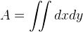
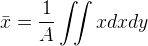
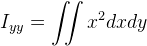
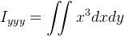
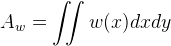
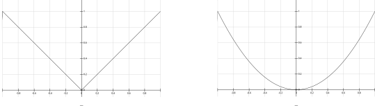
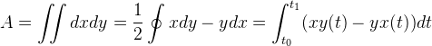
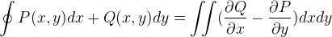
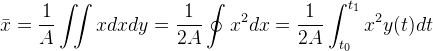
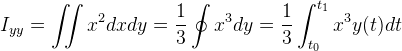

David Kindersley's spacing methods
==================================

In the 1950s, Kindersley began researching methods to find the
"optical center" of glyphs&mdash;in other words, the point at which
the left and right sides of the glyph "appear" balanced to the eye.

This work was a rare foray into trying to experimentally determine
what underlying factors might be at work when designers visually
adjust spacing for perceptual balance.

The Kindersley Workshop has [an
overview](http://www.kindersleyworkshop.co.uk/spacing/) of the process
documented at its web site; a far more thorough discussion is found in
Kindersley's book, <cite>Optical letter spacing for new printing
systems</cite>, 1966, 1976 (reprinted 2001).

Kindersley's initial approach was to project light through cut outs of
glyphs, and measure the actual amount of light that fell on each side
of a dividing line.  Adjusting the divider could easily find the
midpoint at which an equal amount of light fell on the left and right,
meaning that there was an equal "grayness" (or black-to-white ratio,
perhaps) between the two sides.

It was immediately clear that this equal-energy dividing line was
*not* the optical center, however; the question was to determine what
adjustments to the measurements produced optically balanced spacing.

Kindersley determined that this method produced acceptable results
only if the grayness measurements were taken with the center of the
glyph masked off; the opacity and degree to which the center of a
glyph should be masked off for optimal results was the focus of the
research.  He experimentally tested this method with a variety of
typefaces, including uprights and Italics.

Balance theory
--------------

Kindersley began by describing the underlying goal of optical spacing:

<blockquote>
"Quite simply I mean that each letter should appear to be exactly in
the centre between its two neighbours. To me this is the only
criterion, and I do not believe that it requires any further
justification. Put another way, any letter should occupy a passive
position between its neighbours."
</blockquote>

He knew from practical experience that the midpoint between
a glyph's two extrema was not the location of the optical axis.  He
looked at four other axes, which he listed as:

1. area
2. first moment (gravity)
3. second moment (inertia)
4. third moment (optical?)

Kindersley's terminology is, at times, problematic, due to the fact
that several different geometrical and statistical properties are
sometimes referred to, informally, in similar-sounding terms.  It is not
always obvious which property Kindersley is describing.  However, by
examining the test design, it is clear what was being testing.

The "area" axis seems to correspond to the x-axis location of the
geometric median&mdash;the line that divides the glyph into two parts
of equal area. 

The "first moment" seems to correspond to the geometric mean or
centroid, which (for solids of uniform density) corresponds to the
center of mass or center of gravity&mdash;hence the "gravity" designation.  

The "second moment" seems to correspond to the planar second moment of
area with respect to the y axis.  By analogy, this is akin to the
second moment of inertia in physics (which is also the integral of the
x-distance squared multiplied by the "area").

Following this progression, the "third moment" would be the
integral of the differential area multiplied by the cube of the
distance to the y-axis.

Kindersley initially suspected that the optical center of a glyph
would be not on the axis through its center of mass, but through its
third moment center.  To test this theory, he constructed the
experimental apparatus described above.  Two photocells measured the
amount of light that fell on each side of a line dividing a glyph; the
division point could be adjusted until the two halves produced equal
measurements.

It is not clear from the book what the light source(s) were nor how
they were arranged; physical factors such as light falloff could, in theory, have affected the
measurements; computing the same quantities mathematically is
simpler in this respect.

Following the initial test runs, he adapted the mechanism to mask off
a portion of each glyphs' center.  The masks (or "wedges") were made
of an opaque material perforated with holes in a gradient pattern,
beginning with 100% opacity at the center and transitioning to 100%
translucent at the extrema. 

This has the effect of applying a weight function in x to the area on
each side of the dividing line.

Several gradient functions were
tested, it seems: at least linear, quadratic, and cubic.  The
gradients were uniform in the y direction; the light they transmit is
thus a function of x on the interval [0,1].

The rationale for the gradients described in the book is
that the outer portions of the glyph "contributed" more than the
interior.  Kindersley did speculate
about using two-dimensional gradient shapes (parabolas,
specifically), but it does not seem that he tested such gradients in practice.

Importantly, multiplying the linear, quadratic, and cubic weight
functions by the differential area inside the region measured gives
the equivalent of the geometric mean, planar second moment, and the
third moment.  So measuring the grayness of the sides of a glyph via
photocell through the gradient masks is the equivalent of computing
the "first," "second," and "third" moments directly.

Kindersley's observations
-------------------------

Kindersley reported that using the quadratic gradient masks produced results
"close" to what was expected.  He also made several other observations
along the way.

First, he noted that ascenders and descenders do not seem to contribute to the
location of the optical center (i.e., h and n have the same center, as
do v and y).  Instead, the optical centering happens within the
x-height rectangle. 

Second, he tested italic and slanted typefaces using the same method
as uprights, and determined that the gradient mask needed to be tilted
at the same angle as the italic in order to produce satisfactory
results.

Implementation talk
-------------------

The "equal area" axis is difficult to find for a generic shape, since
the [geometric
median](https://en.wikipedia.org/wiki/Geometric_median), unlike the
[geometric mean](https://en.wikipedia.org/wiki/Centroid), has no
simple formula.

For simple, closed Bezier curves, however, [Green's
theorem](https://en.wikipedia.org/wiki/Green's_theorem) provides a
practical solution.  One can compute the line integral of the
Beziers that make up a glyph (or, for the purposes of the experiment,
for each half of a glyph that is split vertically) and find the area.

Moreover, Green's theorem allows one to compute the geometric mean,
planar second moment, and even third moment in the same manner, so
the effects of applying the weight functions or gradient masks is
easily computable as well.

The generic form of the relation:

holds for any choice of the functions *P* and *Q* that have continuous
partial derivatives.  For the area calculation, one chooses `P = -y/2`
and `Q = x/2`.  For the first moment, one could choose `P = -y^2/2` and `Q
= 0`:

or, for the second moment, `P = -y^3/3` and `Q = 0`:

<!-- (kindersley-green-3rdmoment.png) -->

A software implementation of Kindersley's experiments could easily
truncate glyphs at the baseline and x-height to emulate the findings
about extenders having no discernible impact on optical centering.  In
addition, a simple rotation of italic or oblique glyphs would suffice
to reproduce the slanted gradients.

It would be interesting to apply Kindersley's speculation about
two-dimensional gradients using this method, which Kindersley and his
colleagues never put to the test with practical experiments.

It would also be interesting to try and reproduce Kindersley's
original results symbolically or computationally.  As noted earlier,
it is unclear if the physical test apparatus used took light falloff
into account; if it did not, then perhaps that contributed some
portion to the divergent results found testing the quadratic gradient masks.

Kindersley's foray into optical spacing by these means seems to have
come to a halt in the 1970s, at the dawn of the personal computing
era.  More could surely be done with the computing resources available today.

Limitations
-----------

A fundamental limitation of the optical-centering work is that it
produces only the "balance point" for each glyph.  Converting those
points into a set of sidebearings requires adding space to both sides
of the balance points.

Kindersley asserted that each letter should be spaced by adding an
equal amount to each side of the balance point, and that the correct
amount for any given letter could be determined by placing it between
a pair of already-spaced test strings: "O I" on the left, and "I O" on
the right.

Thus, spacing a typeface would involve first finding the optical
centers for each glyph, then spacing "I" between a pair of "O"s and
"O" between a pair of "I"s; then spacing the remaining letters
individually.  For some glyphs, the minimum possible space is required
on one side (namely, "L"), but Kindersley argued that, whatever
initial set of sidebearings one finds, the sidebearings of the entire
typeface can be incremented by the same amount, as desired.

A number of sources report that Kindersley's approach produces its best results
for text set in all capitals.  This is, perhaps, expected, since most
of his research was conducted on all-capital Latin text (with an eye
toward improving public signage).   It is possible that his results
lean toward success with glyphs all of one height as a result.

That observation does hold with Kindersley's
note that his method did not respond to extenders, since only "Q"
among the usual Roman capitals features an extender.  Whether or not
two-dimensional masks would have impacted that finding remains an open
question.  

